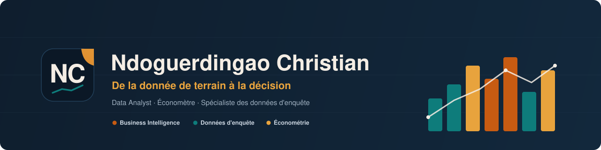

<!--
====================================================================
 README DE PROFIL — V2  ///  Ndoguerdingao Christian
 Dépôt : github.com/ndoguerdingaochristian-data/ndoguerdingaochristian-data
 À personnaliser : {{CV_URL}} -> lien de votre CV (les 2 boutons CV). Tout le reste est rempli.
 et les [ex. : ...] (vraies métriques). Déposer brand/ dans /assets.
 Règle : titres sans emoji (ancres propres). Hero sans service tiers.
====================================================================
-->

<div align="center">
  
</div>

<p align="center">
  <b>Je transforme des données d'enquête collectées sur le terrain en décisions que des organisations peuvent défendre.</b>
</p>

<!-- Appels à l'action -->
<p align="center">
  <a href="#etudes-de-cas"></a>
  <a href="{{CV_URL}}"></a>
  <a href="https://www.linkedin.com/in/ndoguerdingao-christian"></a>
  <a href="mailto:ndoguerdingaochristian@gmail.com"></a>
</p>

<!-- Navigation (texte pur, sans emoji, ancres propres) -->
<p align="center">
  <a href="#en-bref">En bref</a> ·
  <a href="#ce-que-je-fais">Ce que je fais</a> ·
  <a href="#ce-que-je-maitrise">Compétences</a> ·
  <a href="#etudes-de-cas">Études de cas</a> ·
  <a href="#comment-je-travaille">Méthode</a> ·
  <a href="#parcours">Parcours</a> ·
  <a href="#contact">Contact</a>
</p>

---

## En bref

Économètre et analyste de données à Yaoundé, spécialisé dans les **données d'enquête** pour les secteurs **humanitaire et du développement**. Ma singularité tient en une phrase : je couvre **toute la chaîne**, du questionnaire de terrain jusqu'au tableau de bord qui éclaire la décision.

> [!NOTE]
> Je maîtrise la chaîne complète de la donnée d'enquête, je raisonne en économètre (le « pourquoi », pas seulement le « combien »), et je documente chaque projet comme une étude de cas de cabinet.

## Ce que je fais

**D'où je viens.** Une formation d'économètre (Master 2 MASS, Université de Yaoundé II) qui m'a appris une chose avant tout : un chiffre ne vaut que si l'on peut le défendre, de la source jusqu'à la conclusion.

**Ce que je fais.** La plupart des analystes interviennent sur un maillon. Moi, je prends la donnée là où elle naît, sur le terrain, et je l'accompagne jusqu'à la décision :

```
Questionnaire        Collecte           Nettoyage &         Analyse            Tableau de bord
(KoboToolbox, ODK) → (terrain, mobile) → préparation      → (stats, écono-    → & restitution
                                          & contrôle          métrie)             décisionnelle
```

**La preuve.** Chaque projet ci-dessous est documenté comme une étude de cas : problème, contraintes, choix, difficultés, résultats, limites. Pas une liste de fichiers, une histoire.

## Ce que je maitrise

| Domaine | Ce que je livre concrètement |
| :--- | :--- |
| **Business Intelligence** | Modèles de données, mesures DAX, tableaux de bord Power BI |
| **Analyse & statistiques** | Nettoyage, tests, régressions, statistique inférentielle |
| **Économétrie** | Inférence causale, décompositions, correction de biais de sélection |
| **Données d'enquête** | Plan de sondage, pondération, indicateurs MEL, contrôle qualité |
| **Data Visualization** | Restitution claire, honnête, orientée décision |

**Outils principaux**


<details>
<summary>Voir l'ensemble des outils</summary>

<br/>

Excel, XlsForm, ODK, Jupyter, LaTeX, Git, VS Code. Le détail par catégorie figure dans chaque étude de cas.

</details>

## Études de cas

> Chaque projet mène à un dépôt documenté comme une étude de cas de conseil.

### Tableau de bord Power BI : Centre de Formation

<a href="https://github.com/ndoguerdingaochristian-data/pilotage-centre-formation"></a>

<div align="center">
  
</div>

- **Problème** : piloter l'activité d'un centre de formation dispersée dans plusieurs fichiers Excel.
- **Ce que j'ai fait** : modèle de données, mesures DAX, tableau de bord multi-pages.
- **Résultat** : 6 pages décisionnelles, 10 sources, 48 mesures DAX ; suivi de 650 apprenants et 8 programmes.
- **Outils** : `Power BI` · `Excel` · `DAX`

**Toutes mes études de cas**

| Étude de cas | Ce qu'elle démontre | Outils |
| :--- | :--- | :--- |
| [Pilotage d'un centre de formation](https://github.com/ndoguerdingaochristian-data/pilotage-centre-formation) | BI d'entreprise, 6 pages, 48 mesures DAX | `Power BI` |
| [Insécurité alimentaire au Sahel](https://github.com/ndoguerdingaochristian-data/tableau-de-bord-insecurite-alimentaire-sahel) | BI humanitaire sur données FEWS NET et OCHA | `Power BI` |
| [Pauvreté multidimensionnelle au Tchad (MICS6)](https://github.com/ndoguerdingaochristian-data/pauvrete-multidimensionnelle-tchad-mics6) | Indices composites sur données d'enquête | `Stata` · `R` |
| [Analyse WASH au Tchad (MICS6)](https://github.com/ndoguerdingaochristian-data/analyse-wash-tchad-mics6) | Accès à l'eau et à l'assainissement | `R` · `Python` |
| [Déplacements forcés au Sahel (UNHCR)](https://github.com/ndoguerdingaochristian-data/deplacements-forces-sahel-unhcr) | Suivi de populations déplacées | `Power BI` |
| [Malnutrition infantile (enquête SMART)](https://github.com/ndoguerdingaochristian-data/malnutrition-infantile-smart-survey) | Indicateurs nutritionnels pondérés | `R` · `Stata` |
| [Système de suivi-évaluation éducation](https://github.com/ndoguerdingaochristian-data/systeme-me-education-sql-powerbi) | Chaîne SQL vers Power BI | `SQL` · `Power BI` |

## Comment je travaille

Ce qu'un client ou un recruteur obtient, au-delà des chiffres :

- **Reproductibilité.** Code versionné, données documentées, résultats retraçables jusqu'à la source. Si je l'affirme, vous pouvez le vérifier.
- **Rigueur avant esthétique.** Les conditions d'un test sont vérifiées avant d'être invoquées. Corrélation n'est pas causalité, et je le dis quand c'est le cas.
- **Un seul interlocuteur** pour toute la chaîne : moins d'intermédiaires entre la question et la réponse.
- **Communication bilingue** (français / anglais), au standard international.
- **Terrain réel.** J'ai collecté en contexte africain, avec ses contraintes. Je sais ce qu'une donnée « propre » cache comme travail.

## Parcours

- **Master 2 : Mathématiques Appliquées aux Sciences Sociales (MASS)**, Université de Yaoundé II
- **Formation Data Analytics** (STATLeaders) : Excel, SQL, Power BI, KoboToolbox, Python

### Certifications

| Certification | Émetteur | Statut | |
| :--- | :--- | :--- | :--- |
| Introduction à la statistique avec R (Université Paris-Saclay) | France Université Numérique |  oct. 2025 | [Vérifier](https://openbadgefactory.com/validator?id=4d674e97c145c145a9b747d4edd96e5609090c6d&lang=fr) |
| Google Data Analytics Professional Certificate | Google (Coursera) |  | - |
| Microsoft Certified: Power BI Data Analyst Associate (PL-300) | Microsoft |  | - |

## Contact

<p align="center">
  <a href="https://www.linkedin.com/in/ndoguerdingao-christian"></a>
  <a href="mailto:ndoguerdingaochristian@gmail.com"></a>
  <a href="{{CV_URL}}"></a>
</p>

<details>
<summary>Activité GitHub</summary>

<br/>

<div align="center">
  
</div>

<sub>Volontairement replié : un service tiers ne doit jamais casser l'en-tête du profil.</sub>

</details>

---

<div align="center">
  
  <br/>
  <sub><i>Une donnée n'a de valeur que si elle éclaire une décision.</i></sub>
</div>
